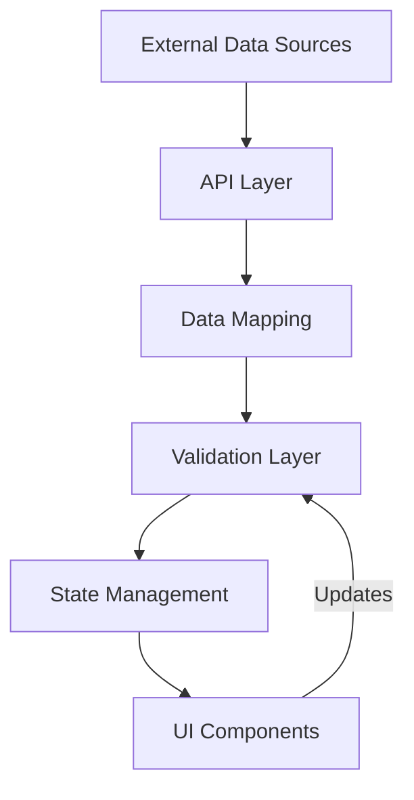
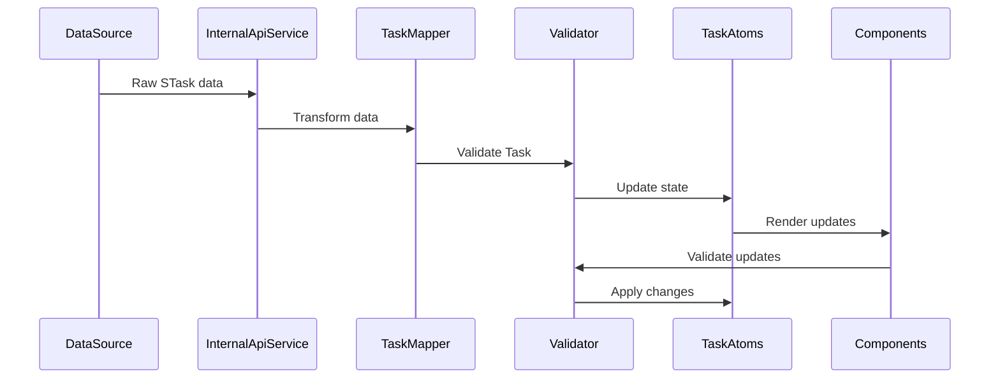

# Data Flow Architecture

## Overview

The application implements a unidirectional data flow with strong type safety and validation at each layer. Data flows from external sources (Obsidian, Dataview) through our API layer, gets validated and transformed, and finally reaches the UI components via a type-safe state management system.



## Layer Details

### 1. External Data Sources

-   **Obsidian Dataview API**: Provides raw task data as `STask[]`
-   **Location**: `src/api/internalApi/dataviewApi.ts`
-   **Key Types**:
    ```typescript
    type STask = {
    	// Dataview's internal task structure
    };
    ```

### 2. API Layer (InternalApiService)

-   **Purpose**: Fetches and processes raw task data
-   **Location**: `src/api/internalApiService.ts`
-   **Key Operations**:
    ```typescript
    class InternalApiService {
    	// Periodic task fetching
    	private async initiatePeriodicTaskFetch() {
    		// 1. Fetch raw tasks
    		// 2. Map to our Task type
    		// 3. Validate
    		// 4. Emit events
    	}
    }
    ```

### 3. Data Mapping Layer

-   **Purpose**: Transforms external data formats to internal Task type
-   **Location**: `src/data/taskMapper.ts`
-   **Key Operations**:
    ```typescript
    class TaskMapper {
    	public mapDvToTaskType(dvTask: dvTaskType): Task;
    	public mapTaskToLineString(task: Task): string;
    	public mapMdToTaskType(lineString: string): Task;
    }
    ```

### 4. Validation Layer

-   **Schema Definition**

    -   **Location**: `src/data/types/tasks.ts`

    ```typescript
    export const TaskSchema: z.ZodType<any> = z.object({
    	id: z.string(),
    	description: z.string(),
    	priority: z.nativeEnum(TaskPriority),
    	// ... other fields
    });
    ```

-   **Validation Functions**

    -   **Location**: `src/data/utils/validateTask.ts`

    ```typescript
    export function validateTask(task: unknown): {
    	isValid: boolean;
    	message: string;
    };

    export function validateTasks(tasks: unknown[]): asserts tasks is Task[];
    ```

### 5. State Management Layer

-   **Technology**: Jotai atoms
-   **Location**: `src/data/taskAtoms.ts`
-   **Key Components**:

    ```typescript
    // Base atom for all tasks
    export const baseTasksAtom = atom<Task[]>([]);

    // Derived atom for task operations
    export const changeTasksAtom = atom(
    	(get) => get(baseTasksAtom),
    	(
    		get,
    		set,
    		change: {
    			operation: storeOperation;
    			tasks: Task[];
    		},
    	) => {
    		// Handle different operations (ADD, UPDATE, DELETE, etc.)
    	},
    );
    ```

### 6. UI Layer

-   **Components**: React components consuming task state
-   **Example**: `src/ui/components/TaskCard.tsx`
-   **State Usage**:
    ```typescript
    const taskAtom = useMemo(
    	() =>
    		atom(
    			// Read operation
    			(get) =>
    				get(changeTasksAtom).find((task) => task.id === taskId),
    			// Write operation
    			(get, set, update: Partial<Task>) => {
    				// Type-safe updates
    			},
    		),
    	[taskId],
    );
    ```

## Type Safety and Validation

### Type Definitions

-   **Core Type**: `Task` (derived from Zod schema)
-   **Operation Types**: `storeOperation` enum
-   **Transfer Types**: `taskObject`, `tasksObject`

### Validation Points

1. **API Layer**: Initial data validation
2. **Mapping Layer**: Type conversion and validation
3. **State Updates**: Pre-update validation
4. **UI Layer**: Type-safe props and state updates

### Error Handling

-   Validation errors caught and logged at each layer
-   Invalid data prevented from entering state
-   Type assertions ensure runtime safety

## Data Flow Example



## Best Practices

1. **Validation First**: Always validate data before state updates
2. **Type Safety**: Use TypeScript types and Zod schema consistently
3. **Error Boundaries**: Handle validation errors at appropriate layers
4. **Single Source of Truth**: State management through Jotai atoms
5. **Immutable Updates**: Use immutable patterns for state changes
