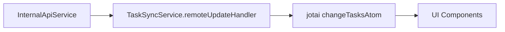
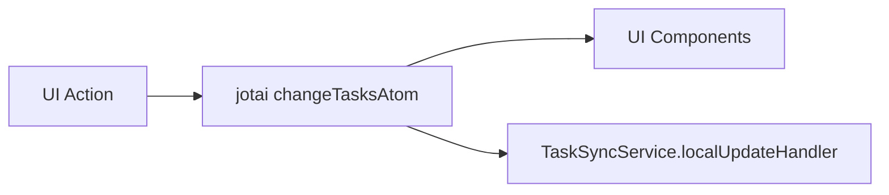

# Technical Details

## Tech Stack

### Core Technologies

-   TypeScript
-   React
-   TailwindCSS
-   Obsidian API

### UI Components

-   shadcn/ui as base component library
-   Custom components built on top of shadcn/ui
-   Obsidian CSS variables integration for theme consistency

### Development Tools

-   ESBuild (bundler)
-   ESLint (linting)
-   Prettier (code formatting)
-   Husky (git hooks)

### Dependencies

-   Tasks Plugin (Obsidian)
-   Dataview Plugin (compatibility)

## Project Structure

-   `src/`: Source code directory
    -   `api/`: Obsidian and Dataview API integration
        -   `internalApi/`: Obsidian API abstractions
        -   `types/`: API type definitions
        -   `internalApiService.ts`: Core API service
    -   `data/`: State and type management
        -   `types/`: Data model type definitions
        -   `utils/`: Data manipulation utilities
        -   `taskMapper.ts`: Task data mapping logic
        -   `taskBuilder.ts`: Task object construction
        -   `taskAtoms.ts`: Jotai state atoms
    -   `service/`: Business logic layer
        -   `types/`: Service type definitions
        -   `taskService.ts`: Task management logic
        -   `taskSyncService.ts`: Sync orchestration
    -   `ui/`: React components and views
        -   `components/`: Shared UI components
        -   `base/`: Base UI elements
        -   `utils/`: UI utility functions
        -   `BoardView.tsx`: Kanban board implementation
        -   `ListView.tsx`: List view implementation
        -   `ErrorView.tsx`: Error handling view
    -   `config/`: Configuration management
    -   `utils/`: Shared utilities
    -   `main.ts`: Plugin entry point
    -   `MainView.tsx`: Root view component
    -   `styles.css`: Global styles

## Build Configuration

-   TypeScript configuration in `tsconfig.json`
-   ESBuild configuration in `esbuild.config.mjs`
-   Tailwind CSS configuration in `tailwind.config.js`

## Code Style

-   Follows Prettier configuration
-   ESLint rules defined in `.eslintrc`
-   Editor configuration in `.editorconfig`

## Architecture Notes

-   Desktop-only application
-   Plugin architecture following Obsidian plugin guidelines
-   React-based UI components
-   TailwindCSS with Obsidian theme integration
-   Bi-directional Markdown sync
-   Tasks plugin compatibility layer
-   Dataview compatibility layer

## Styling Strategy

-   Use shadcn/ui as foundation
-   Reference Obsidian CSS variables for theming
-   Maintain consistent styling with vault themes
-   TailwindCSS for custom components
-   Responsive design for different pane sizes

## View Architecture

-   Tab-based navigation between views
-   Core Views:
    -   Kanban Board
    -   List View
    -   Calendar View
-   Advanced Views (Future):
    -   Due Date View
    -   Project View
    -   Tag View
    -   Custom Views

## State Management Architecture

### Core Principles

-   Jotai is the single source of truth for all application state
-   UI components only react to Jotai state changes
-   No local component state for task data
-   Unidirectional data flow

### Data Flow Patterns

1. **Remote Updates (from InternalApiService)**



2. **Local Updates (from UI actions)**



### Key Components

#### TaskSyncService

-   Handles synchronization between remote data and Jotai state
-   Direct access to Jotai store for state updates
-   No local state management
-   Cleanup functionality for proper resource management

#### UI Components

-   Pure React components that only read from Jotai state
-   No direct state management
-   Use `useAtom` and `useAtomValue` hooks for state access

#### State Update Flow

1. All state changes go through Jotai atoms
2. UI components subscribe to state changes
3. Local updates:
    - Update Jotai state first
    - Then sync to storage
4. Remote updates:
    - Received by TaskSyncService
    - Update Jotai state directly
    - UI automatically updates through state subscription

## Implementation Details

### State Management

```typescript
// Core state atom
const changeTasksAtom = atom<TaskUpdate | null>(null);

// TaskSyncService state updates
private updateState(update: TaskUpdate) {
    this.store.set(changeTasksAtom, update);
}
```

### Component Integration

```typescript
// UI components only use atoms
const [, changeTasks] = useAtom(changeTasksAtom);

// No local state for task data
const TaskList: React.FC = () => {
	const tasks = useAtomValue(tasksAtom);
	// ... render tasks
};
```

## Architecture Layers

### API Layer

-   Abstracts Obsidian API interactions
-   Manages Dataview plugin integration
-   Handles internal API services
-   Type-safe API interfaces

### Data Layer

-   Task data model definitions
-   State management with Jotai
-   Data mapping and transformation
-   Type builders and utilities

### Service Layer

-   TaskService handles external operations (CRUD with Obsidian)
-   Service layer integrates with state through direct updates
-   Clear separation between local state operations and external service calls

### UI Layer

-   View implementations
-   Shared components
-   Base UI elements
-   Error boundaries

## Architecture Overview

### Logging Implementation

-   Using Pino logger with pretty-print in development
-   Structured logging with consistent context
-   Log levels:
    -   info: Successful operations
    -   warn: Non-error but noteworthy situations
    -   error: Failures
    -   debug: Hook-level operations

### Key Components

1. **Task Atoms (`src/data/taskAtoms.ts`)**

    - `baseTasksAtom`: Core state storage
    - `tasksAtom`: Main operation handler
    - Filtered view atoms (todo, inProgress, done)

2. **Task Service (`src/service/taskService.ts`)**

    - Handles external API operations
    - Integrates with Obsidian
    - Error handling and logging

3. **Logger (`src/utils/logger.ts`)**

    - Pino configuration
    - Pretty-print for development
    - Structured logging format

4. **Hooks (`useTasks`)**
    - Provides interface for components
    - Handles both local and service operations
    - Includes logging for operations

### Operation Types

-   ADD: Add single or multiple tasks
-   UPDATE: Update existing task
-   DELETE: Remove task
-   REPLACE: Replace entire task list
-   RESET: Clear all tasks

### Current Implementation Decisions

1. Components work directly with state for local operations
2. Service methods available for external operations
3. Centralized logging for all operations
4. Clear separation between state management and business logic

## Task Validation Architecture

### Schema Definition

-   Located in `src/data/types/tasks.ts`
-   Uses Zod for runtime type validation
-   Defines `TaskSchema` for task structure validation
-   Exports `Task` type inferred from the schema
-   Contains all task-related enums (TaskSource, TaskPriority, TaskStatus)

### Validation Functions

-   Located in `src/data/utils/validateTask.ts`
-   Contains pure validation functions that use the schema
-   `validateTask`: Validates a single task
-   `validateTasks`: Validates an array of tasks

### Design Decisions

-   Schema definition kept with type definitions for better cohesion
-   Validation functions separated to maintain single responsibility
-   Using Zod for both runtime validation and TypeScript type inference
