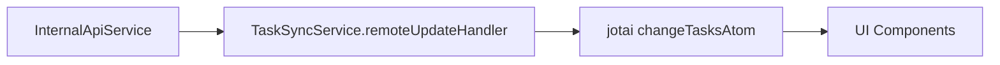
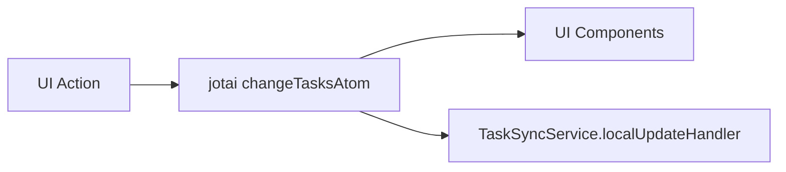

# Technical Details

## Tech Stack

-   **Language:** (Please specify - e.g., Python, TypeScript, Go)
-   **Local Storage:** (Please specify - e.g., SQLite, IndexedDB, Filesystem)
-   **Remote Backend:** (Please specify - e.g., Custom API, Firebase, Supabase)
-   **Frameworks/Libraries:** (Please specify any relevant frameworks or major libraries)

## Architecture

(Describe the high-level architecture, e.g., MVC, MVVM, Layered)

-   **Data Synchronization:** (Describe the current sync mechanism, e.g., polling, websockets, manual triggers). The `REMOTE_UPDATE` operation handles incoming tasks, updating local ones if `needsSync` is false, adding new ones, and deleting local tasks that are absent from the remote update _unless_ the local task has `needsSync=true`.

## Patterns

-   (List any key design patterns used, e.g., Repository, Observer)

## Planned Enhancements

-   Two-way synchronization logic refinement.

## Project Structure

-   `src/`: Source code directory
    -   `api/`: Obsidian and Dataview API integration
        -   `internalApi/`: Obsidian API abstractions
        -   `types/`: API type definitions
        -   `internalApiService.ts`: Core API service
    -   `data/`: State and type management
        -   `types/`: Data model type definitions
        -   `utils/`: Data manipulation utilities
        -   `taskMapper.ts`: Task data mapping logic
        -   `taskBuilder.ts`: Task object construction
        -   `taskAtoms.ts`: Jotai state atoms
    -   `service/`: Business logic layer
        -   `types/`: Service type definitions
        -   `taskService.ts`: Task management logic
        -   `taskSyncService.ts`: Sync orchestration
    -   `ui/`: React components and views
        -   `components/`: Shared UI components
        -   `base/`: Base UI elements
        -   `utils/`: UI utility functions
        -   `BoardView.tsx`: Kanban board implementation
        -   `ListView.tsx`: List view implementation
        -   `ErrorView.tsx`: Error handling view
    -   `config/`: Configuration management
    -   `utils/`: Shared utilities
    -   `main.ts`: Plugin entry point
    -   `MainView.tsx`: Root view component
    -   `styles.css`: Global styles

## Build Configuration

-   TypeScript configuration in `tsconfig.json`
-   ESBuild configuration in `esbuild.config.mjs`
-   Tailwind CSS configuration in `tailwind.config.js`

## Code Style

-   Follows Prettier configuration
-   ESLint rules defined in `.eslintrc`
-   Editor configuration in `.editorconfig`

## Architecture Notes

-   Desktop-only application
-   Plugin architecture following Obsidian plugin guidelines
-   React-based UI components
-   TailwindCSS with Obsidian theme integration
-   Bi-directional Markdown sync
-   Tasks plugin compatibility layer
-   Dataview compatibility layer

## Styling Strategy

-   Use shadcn/ui as foundation
-   Reference Obsidian CSS variables for theming
-   Maintain consistent styling with vault themes
-   TailwindCSS for custom components
-   Responsive design for different pane sizes

## View Architecture

-   Tab-based navigation between views
-   Core Views:
    -   Kanban Board
    -   List View
    -   Calendar View
-   Advanced Views (Future):
    -   Due Date View
    -   Project View
    -   Tag View
    -   Custom Views

## State Management Architecture

### Core Principles

-   Jotai is the single source of truth for all application state
-   UI components only react to Jotai state changes
-   No local component state for task data
-   Unidirectional data flow

### Data Flow Patterns

1. **Remote Updates (from InternalApiService)**



2. **Local Updates (from UI actions)**



### Key Components

#### TaskSyncService

-   Handles synchronization between remote data and Jotai state
-   Direct access to Jotai store for state updates
-   No local state management
-   Cleanup functionality for proper resource management

#### UI Components

-   Pure React components that only read from Jotai state
-   No direct state management
-   Use `useAtom` and `useAtomValue` hooks for state access

#### State Update Flow

1. All state changes go through Jotai atoms
2. UI components subscribe to state changes
3. Local updates:
    - Update Jotai state first
    - Then sync to storage
4. Remote updates:
    - Received by TaskSyncService
    - Update Jotai state directly
    - UI automatically updates through state subscription

## Sync System Technical Implementation

### Current Architecture

-   Local state management using React state/context
-   Direct sync operations with Obsidian vault
-   Basic error handling and retries

### Planned Improvements

#### High Priority

1. **Retry Mechanism**

    - Implementation: Exponential backoff strategy
    - State tracking for failed operations
    - Maximum retry attempts configuration
    - Persistent retry queue

2. **Batch Processing**

    - Queue system for sync operations
    - Configurable batch size and timing
    - Priority-based processing
    - Transaction-like handling for batches

3. **Conflict Resolution**
    - Timestamp-based version tracking
    - Merge strategy for concurrent changes
    - User resolution interface for conflicts
    - Change history tracking

#### Medium Priority

1. **Sync Queue**

    - Persistent queue storage
    - Background processing
    - Queue state management
    - Operation prioritization

2. **Version Control**
    - Change tracking system
    - Version numbering scheme
    - Rollback capabilities
    - Diff generation for changes

#### Low Priority

1. **Performance Optimizations**

    - Network request batching
    - Local caching improvements
    - Background sync scheduling
    - Resource usage optimization

2. **Error Reporting**
    - Detailed error logging
    - User-friendly error messages
    - Error analytics and tracking
    - Recovery suggestions

### Implementation Dependencies

-   React state management library (TBD)
-   Local storage solution
-   Network request handling library
-   Background processing capabilities

## Implementation Details

### State Management

```typescript
// Core state atom
const changeTasksAtom = atom<TaskUpdate | null>(null);

// TaskSyncService state updates
private updateState(update: TaskUpdate) {
    this.store.set(changeTasksAtom, update);
}
```

### Component Integration

```typescript
// UI components only use atoms
const [, changeTasks] = useAtom(changeTasksAtom);

// No local state for task data
const TaskList: React.FC = () => {
	const tasks = useAtomValue(tasksAtom);
	// ... render tasks
};
```

## Architecture Layers

### API Layer

-   Abstracts Obsidian API interactions
-   Manages Dataview plugin integration
-   Handles internal API services
-   Type-safe API interfaces

### Data Layer

-   Task data model definitions
-   State management with Jotai
-   Data mapping and transformation
-   Type builders and utilities

### Service Layer

-   TaskService handles external operations (CRUD with Obsidian)
-   Service layer integrates with state through direct updates
-   Clear separation between local state operations and external service calls

### UI Layer

-   View implementations
-   Shared components
-   Base UI elements
-   Error boundaries

## Architecture Overview

### Logging Implementation

-   Using Pino logger with pretty-print in development
-   Structured logging with consistent context
-   Log levels:
    -   info: Successful operations
    -   warn: Non-error but noteworthy situations
    -   error: Failures
    -   debug: Hook-level operations

### Key Components

1. **Task Atoms (`src/data/taskAtoms.ts`)**

    - `baseTasksAtom`: Core state storage
    - `tasksAtom`: Main operation handler
    - Filtered view atoms (todo, inProgress, done)

2. **Task Service (`src/service/taskService.ts`)**

    - Handles external API operations
    - Integrates with Obsidian
    - Error handling and logging

3. **Logger (`src/utils/logger.ts`)**

    - Pino configuration
    - Pretty-print for development
    - Structured logging format

4. **Hooks (`useTasks`)**
    - Provides interface for components
    - Handles both local and service operations
    - Includes logging for operations

### Operation Types

-   ADD: Add single or multiple tasks
-   UPDATE: Update existing task
-   DELETE: Remove task
-   REPLACE: Replace entire task list
-   RESET: Clear all tasks

### Current Implementation Decisions

1. Components work directly with state for local operations
2. Service methods available for external operations
3. Centralized logging for all operations
4. Clear separation between state management and business logic

## Task Validation Architecture

### Schema Definition

-   Located in `src/data/types/tasks.ts`
-   Uses Zod for runtime type validation
-   Defines `TaskSchema` for task structure validation
-   Exports `Task` type inferred from the schema
-   Contains all task-related enums (TaskSource, TaskPriority, TaskStatus)

### Validation Functions

-   Located in `src/data/utils/validateTask.ts`
-   Contains pure validation functions that use the schema
-   `validateTask`: Validates a single task
-   `validateTasks`: Validates an array of tasks

### Design Decisions

-   Schema definition kept with type definitions for better cohesion
-   Validation functions separated to maintain single responsibility
-   Using Zod for both runtime validation and TypeScript type inference

## Validation Strategy

### Task Validation

The `InternalApiService` consistently uses `validateTasks` for all task validation, even for single tasks. This is intentional because:

1. It provides a single consistent validation interface throughout the service
2. `validateTasks` internally uses `validateTask`, ensuring consistent validation logic
3. For single task validation, the task is wrapped in an array: `validateTasks([task])`
4. The performance overhead is negligible

While direct use of `validateTask` for single tasks would also work, the current approach maintains consistency and correctness.

## Architecture

### State Management

The application uses Jotai for state management with the following key atoms:

1. **baseTasksAtom**

    - Core atom storing tasks with metadata
    - Type: `TaskWithMetadata[]`

### Task Comparison Logic

The system uses a two-tier comparison strategy for matching remote tasks with local tasks:

1. **Primary Matching**

    - Based on task ID
    - Direct equality comparison
    - Most reliable for tracking task identity

2. **Secondary Matching**

    - Used when ID matching fails
    - Matches on both description AND status
    - Helps identify same tasks with different IDs
    - Useful for handling tasks created in different contexts

3. **Update Rules**
    - Local changes (needsSync=true) are protected from remote updates
    - Remote tasks with no matches are added as new
    - Matches trigger an update unless protected by needsSync

This approach provides flexibility in task identification while maintaining data integrity and preventing unwanted overwrites of local changes.

### Task Synchronization (Obsidian API)

-   The `ObsidianApiProvider` class (`src/api/internalApi/obsidianApi.ts`) handles CRUD operations for tasks within Obsidian markdown files.
-   **Task Line Matching (`findTaskLineIndex`):** To locate existing tasks for updates or deletions, the system uses a multi-stage approach:
    1.  **Exact Match:** Compares the full raw line string.
    2.  **ID Match:** Looks for an explicit `[id::...]` tag within the line and uses that for matching.
    3.  **Content Match (Ignoring Prefix):** If no ID is found, it compares the trimmed content of the line _after_ stripping any leading task marker patterns (like `- [ ]`, `- [/]`, etc.) using the regex `/^\\s*-\\s*\\[.?\\]\\s*/`. This ensures matching even if the status marker differs or is absent in the lookup string.
-   Tasks are typically added under a specified markdown heading within the target file.

## Component Interaction Patterns

### Event Handling and State Mutation (Parent Component Responsibility)

**Pattern:** Child components (like `TaskCard`) contain the UI elements that trigger actions (e.g., Edit/Delete buttons), but they signal these actions to parent components (like `KanbanBoard`) via callback props (e.g., `onEdit`, `onDelete`). The parent component, which has access to the centralized state management (Jotai setters), is responsible for handling the actual state mutation.

**Rationale:**

1.  **Centralized State Management:** Aligns with using Jotai (or similar libraries) where specific atoms/hooks manage state changes. Keeps mutation logic consolidated.
2.  **Separation of Concerns:**
    -   Child components focus on presentation and signaling user intent.
    -   Parent components focus on orchestrating actions and interacting with the state layer.
3.  **Clear Data Flow:** Uses explicit callback props, making the data/event flow predictable.
4.  **Component Reusability & Decoupling:** Child components remain unaware of the specific state management implementation or the details of the editing/deletion process (e.g., which form to open), making them more reusable.

**Example:** `newTaskCard.tsx` has Edit/Delete buttons that call `onEdit`/`onDelete` props. `newTaskBoard.tsx` provides these functions, which then might set local state (like `editingTask`) or call Jotai setters directly to modify the task list.
