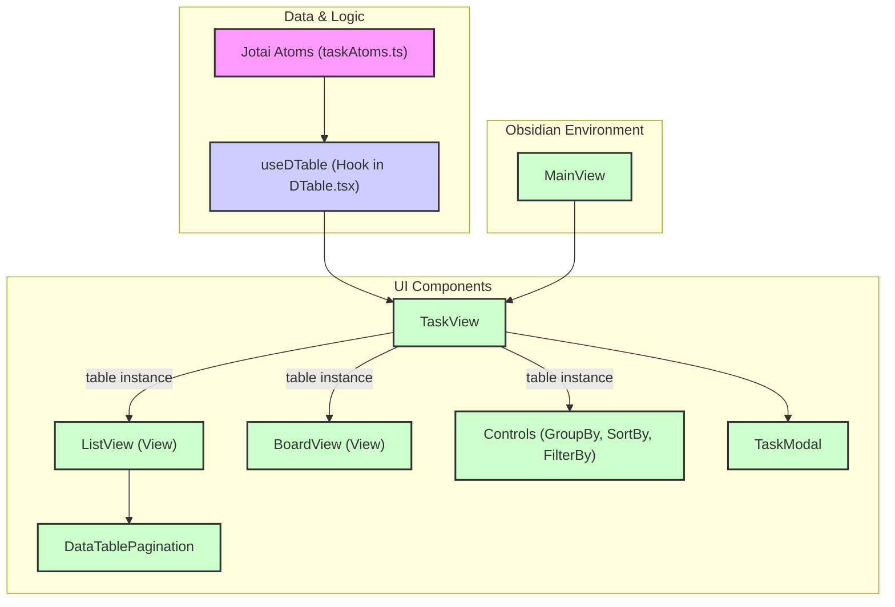

# Technical Details

## Tech Stack

-   **Language:** TypeScript
-   **Frameworks/Libraries:** React, Jotai, TanStack Table, shadcn/ui, TailwindCSS, Lucide Icons
-   **Environment:** Obsidian Plugin API
-   **Build Tools:** ESBuild, PNPM

## Architecture

-   **UI:** React Functional Components with Hooks
-   **State Management:** Jotai (atomic state)
-   **Data Fetching/Sync:** Custom services interacting with Obsidian API (`InternalApiService`, `TaskSyncService`)
-   **Styling:** TailwindCSS utility classes + shadcn/ui components, leveraging Obsidian theme variables.

## Patterns

-   Atomic State Management (Jotai)
-   Custom Hooks (`useDTable`)
-   Service Layer for API/Sync logic
-   Component Composition

## UI Component Structure

-   **`MainView`**: Root component rendering the UI within Obsidian.
-   **`TaskView`**: Main view orchestrator.
    -   Calls `useDTable` hook to get the table instance and logic.
    -   Manages view switching (Tabs: List, Board, Calendar).
    -   Renders shared controls (`DTableGroupBy`, `DTableSortBy`, `DTableFilterBy`).
    -   Defines action handlers (`handleEditTask`, `handleDeleteTask`) and passes them via `table.options.meta`.
    -   Renders the active view component (`ListView`, `BoardView`) passing the `table` instance.
-   **`useDTable` (in `DTable.tsx`)**: Custom hook encapsulating TanStack Table configuration.
    -   Defines columns (without UI rendering logic).
    -   Manages table state (sorting, grouping, filtering, pagination) via Jotai atoms and local state.
    -   Accepts action handlers via props and includes them in `meta`.
    -   Returns the configured `table` instance.
-   **View Components (`ListView`, `BoardView`)**: Responsible for rendering tasks in a specific format.
    -   Receive the `table` instance from `TaskView`.
    -   Render the table structure (headers, rows, cells) using `flexRender`.
    -   Access action handlers from `table.options.meta` to render action buttons.
    -   `ListView` includes `DataTablePagination`.
-   **Control Components (`DTableGroupBy`, `DTableSortBy`, `DTableFilterBy`)**: Reusable controls for table manipulation.
    -   Receive the `table` instance.
    -   Interact with table state methods (`setGrouping`, `setSorting`, `setColumnFilters`).
-   **Shared Components (`TaskModal`, `DataTablePagination`)**: Reusable UI elements.

## UI Component Structure Chart



## Overall Application Architecture Chart

```mermaid
graph TD
    subgraph Obsidian
        ObsidianAPI[Obsidian API / Dataview]
    end

    subgraph Services
        ApiService[InternalApiService]
        SyncService[TaskSyncService]
    end

    subgraph State
        JotaiStore["Jotai Atoms (taskAtoms.ts)"]
    end

    subgraph Core Logic
        useDTableHook["useDTable Hook"]
    end

    subgraph UI Layer
        TaskViewComponent[TaskView Component]
        ViewComponents[View Components (List, Board)]
        ControlComponents[Control Components (Group, Sort, Filter)]
        TaskModalComponent[TaskModal Component]
        PaginationComponent[Pagination Component]
    end

    %% Data Flow
    ObsidianAPI <--> ApiService
    ApiService --> SyncService
    SyncService <--> JotaiStore
    JotaiStore --> useDTableHook
    useDTableHook --> TaskViewComponent
    TaskViewComponent -- table instance --> ViewComponents
    TaskViewComponent -- table instance --> ControlComponents
    ViewComponents --> PaginationComponent
    TaskViewComponent -- Creates --> TaskModalComponent
    TaskModalComponent -- Add/Edit Task --> JotaiStore
    ControlComponents -- Updates State --> useDTableHook
    ViewComponents -- Delete/Edit Task --> TaskViewComponent

    %% Styling
    classDef obsidian fill:#ddd,stroke:#333,stroke-width:2px;
    classDef service fill:#add,stroke:#333,stroke-width:2px;
    classDef state fill:#f9f,stroke:#333,stroke-width:2px;
    classDef hook fill:#ccf,stroke:#333,stroke-width:2px;
    classDef ui fill:#cfc,stroke:#333,stroke-width:2px;

    class ObsidianAPI obsidian;
    class ApiService,SyncService service;
    class JotaiStore state;
    class useDTableHook hook;
    class TaskViewComponent,ViewComponents,ControlComponents,TaskModalComponent,PaginationComponent ui;
```

## Data Synchronization

(Describe the current sync mechanism, e.g., polling, websockets, manual triggers). The `REMOTE_UPDATE` operation handles incoming tasks, updating local ones if `needsSync` is false, adding new ones, and deleting local tasks that are absent from the remote update _unless_ the local task has `needsSync=true`.

## Planned Enhancements

-   Two-way synchronization logic refinement.

## Project Structure

-   `src/`: Source code directory
    -   `api/`: Obsidian and Dataview API integration
        -   `internalApi/`: Obsidian API abstractions
        -   `types/`: API type definitions
        -   `internalApiService.ts`: Core API service
    -   `data/`: State and type management
        -   `types/`: Data model type definitions
        -   `utils/`: Data manipulation utilities
        -   `taskMapper.ts`: Task data mapping logic
        -   `taskBuilder.ts`: Task object construction
        -   `taskAtoms.ts`: Jotai state atoms
    -   `service/`: Business logic layer
        -   `types/`: Service type definitions
        -   `taskService.ts`: Task management logic
        -   `taskSyncService.ts`: Sync orchestration
    -   `ui/`: React components and views
        -   `components/`: Feature-specific and composed components
            -   `custom/dtable/`: Components related to the data table (`useDTable` hook, controls, pagination)
            -   `shared/`: Components shared across multiple features (e.g., `TaskModal`)
            -   `views/`: Components representing major view modes (`ListView`, `BoardView`)
            -   `TaskView.tsx`: Main view orchestrator
        -   `base/`: Generic, reusable base UI elements (Button, Table, etc.) likely from shadcn/ui
        -   `hooks/`: Custom React hooks (potentially empty now)
        -   `lib/`: UI library setup/config (e.g., shadcn utils)
    -   `utils/`: Shared utility functions (logging, etc.)
    -   `main.ts`: Plugin entry point
    -   `MainView.tsx`: Root view component (renders `TaskView`)
    -   `styles.css`: Global styles

## Build Configuration

-   TypeScript configuration in `tsconfig.json`
-   ESBuild configuration in `esbuild.config.mjs`
-   Tailwind CSS configuration in `tailwind.config.js`

## Code Style

-   Follows Prettier configuration
-   ESLint rules defined in `.eslintrc`
-   Editor configuration in `.editorconfig`

## Styling Strategy

-   Use shadcn/ui as foundation
-   Reference Obsidian CSS variables for theming
-   Maintain consistent styling with vault themes
-   TailwindCSS for custom components
-   Responsive design for different pane sizes

## View Architecture

-   Tab-based navigation within `TaskView`
-   Core Views:
    -   List View (`ListView.tsx`)
    -   Kanban Board (`BoardView.tsx`)
    -   Calendar View (Planned)
-   Advanced Views (Future):
    -   Due Date View
    -   Project View
    -   Tag View
    -   Custom Views

## State Management Architecture

### Core Principles

-   Jotai is the single source of truth for all application state
-   UI components react to Jotai state changes derived via hooks (e.g., `useDTable`)
-   Minimize local component state for task data
-   Unidirectional data flow for core state updates

### Data Flow Patterns

1. **Remote Updates (from InternalApiService)**

```mermaid
graph LR
    A[InternalApiService] --> B[TaskSyncService.remoteUpdateHandler]
    B --> C{Jotai Atoms}
    C --> D[UI (via Hooks/Selectors)]
```

2. **Local Updates (from UI actions)**

```mermaid
graph LR
    A[UI Action (e.g., TaskModal save)] --> B{Jotai Atoms}
    B --> C[UI (via Hooks/Selectors)]
    B --> D[TaskSyncService.localUpdateHandler]
    D --> E[InternalApiService (for persistence)]
```

### Key Components

#### TaskSyncService

-   Handles synchronization between remote data (via `InternalApiService`) and Jotai state.
-   Listens to Jotai state changes for local updates to persist.
-   Updates Jotai state upon receiving remote updates.

#### UI Components

-   Read state primarily through custom hooks like `useDTable` or directly via `useAtomValue` if needed.
-   Trigger state changes by calling functions passed via props (like `changeTasks`) or directly setting atoms (use cautiously).

#### State Update Flow

1. State changes are initiated either by UI actions or the `TaskSyncService`.
2. Changes are applied to Jotai atoms.
3. Hooks like `useDTable` react to atom changes, recalculating derived state (like the table instance).
4. UI Components consuming these hooks re-render.
5. `TaskSyncService` also listens to atom changes to persist local updates.

## Sync System Technical Implementation

### Current Architecture

-   State managed by Jotai.
-   `TaskSyncService` orchestrates updates between Jotai and `InternalApiService`.
-   `InternalApiService` handles direct interaction with Obsidian/Dataview APIs.

### Planned Improvements

#### High Priority

1. **Retry Mechanism**

    - Implementation: Exponential backoff strategy
    - State tracking for failed operations
    - Maximum retry attempts configuration
    - Persistent retry queue

2. **Batch Processing**

    - Queue system for sync operations
    - Configurable batch size and timing
    - Priority-based processing
    - Transaction-like handling for batches

3. **Conflict Resolution**
    - Timestamp-based version tracking
    - Merge strategy for concurrent changes
    - User resolution interface for conflicts
    - Change history tracking

#### Medium Priority

1. **Sync Queue**

    - Persistent queue storage
    - Background processing
    - Queue state management
    - Operation prioritization

2. **Version Control**
    - Change tracking system
    - Version numbering scheme
    - Rollback capabilities
    - Diff generation for changes

#### Low Priority

1. **Performance Optimizations**

    - Network request batching
    - Local caching improvements
    - Background sync scheduling
    - Resource usage optimization

2. **Error Reporting**
    - Detailed error logging
    - User-friendly error messages
    - Error analytics and tracking
    - Recovery suggestions

### Implementation Dependencies

-   React state management library (TBD)
-   Local storage solution
-   Network request handling library
-   Background processing capabilities

## Implementation Details

### State Management

```typescript
// Core state atom
const changeTasksAtom = atom<TaskUpdate | null>(null);

// TaskSyncService state updates
private updateState(update: TaskUpdate) {
    this.store.set(changeTasksAtom, update);
}
```

### Component Integration

```typescript
// UI components only use atoms
const [, changeTasks] = useAtom(changeTasksAtom);

// No local state for task data
const TaskList: React.FC = () => {
	const tasks = useAtomValue(tasksAtom);
	// ... render tasks
};
```

## Architecture Layers

### API Layer

-   Abstracts Obsidian API interactions
-   Manages Dataview plugin integration
-   Handles internal API services
-   Type-safe API interfaces

### Data Layer

-   Task data model definitions
-   State management with Jotai
-   Data mapping and transformation
-   Type builders and utilities

### Service Layer

-   TaskService handles external operations (CRUD with Obsidian)
-   Service layer integrates with state through direct updates
-   Clear separation between local state operations and external service calls

### UI Layer

-   View implementations
-   Shared components
-   Base UI elements
-   Error boundaries

## Architecture Overview

### Logging Implementation

-   Using Pino logger with pretty-print in development
-   Structured logging with consistent context
-   Log levels:
    -   info: Successful operations
    -   warn: Non-error but noteworthy situations
    -   error: Failures
    -   debug: Hook-level operations

### Key Components

1. **Task Atoms (`src/data/taskAtoms.ts`)**

    - `baseTasksAtom`: Core state storage
    - `tasksAtom`: Main operation handler
    - Filtered view atoms (todo, inProgress, done)

2. **Task Service (`src/service/taskService.ts`)**

    - Handles external API operations
    - Integrates with Obsidian
    - Error handling and logging

3. **Logger (`src/utils/logger.ts`)**

    - Pino configuration
    - Pretty-print for development
    - Structured logging format

4. **Hooks (`useTasks`)**
    - Provides interface for components
    - Handles both local and service operations
    - Includes logging for operations

### Operation Types

-   ADD: Add single or multiple tasks
-   UPDATE: Update existing task
-   DELETE: Remove task
-   REPLACE: Replace entire task list
-   RESET: Clear all tasks

### Current Implementation Decisions

1. Components work directly with state for local operations
2. Service methods available for external operations
3. Centralized logging for all operations
4. Clear separation between state management and business logic

## Task Validation Architecture

### Schema Definition

-   Located in `src/data/types/tasks.ts`
-   Uses Zod for runtime type validation
-   Defines `TaskSchema` for task structure validation
-   Exports `Task` type inferred from the schema
-   Contains all task-related enums (TaskSource, TaskPriority, TaskStatus)

### Validation Functions

-   Located in `src/data/utils/validateTask.ts`
-   Contains pure validation functions that use the schema
-   `validateTask`: Validates a single task
-   `validateTasks`: Validates an array of tasks

### Design Decisions

-   Schema definition kept with type definitions for better cohesion
-   Validation functions separated to maintain single responsibility
-   Using Zod for both runtime validation and TypeScript type inference

## Validation Strategy

### Task Validation

The `InternalApiService` consistently uses `validateTasks` for all task validation, even for single tasks. This is intentional because:

1. It provides a single consistent validation interface throughout the service
2. `validateTasks` internally uses `validateTask`, ensuring consistent validation logic
3. For single task validation, the task is wrapped in an array: `validateTasks([task])`
4. The performance overhead is negligible

While direct use of `validateTask` for single tasks would also work, the current approach maintains consistency and correctness.

## Architecture

### State Management

The application uses Jotai for state management with the following key atoms:

1. **baseTasksAtom**

    - Core atom storing tasks with metadata
    - Type: `TaskWithMetadata[]`

### Task Comparison Logic

The system uses a two-tier comparison strategy for matching remote tasks with local tasks:

1. **Primary Matching**

    - Based on task ID
    - Direct equality comparison
    - Most reliable for tracking task identity

2. **Secondary Matching**

    - Used when ID matching fails
    - Matches on both description AND status
    - Helps identify same tasks with different IDs
    - Useful for handling tasks created in different contexts

3. **Update Rules**
    - Local changes (needsSync=true) are protected from remote updates
    - Remote tasks with no matches are added as new
    - Matches trigger an update unless protected by needsSync

This approach provides flexibility in task identification while maintaining data integrity and preventing unwanted overwrites of local changes.

### Task Synchronization (Obsidian API)

-   The `ObsidianApiProvider` class (`src/api/internalApi/obsidianApi.ts`) handles CRUD operations for tasks within Obsidian markdown files.
-   **Task Line Matching (`findTaskLineIndex`):** To locate existing tasks for updates or deletions, the system uses a multi-stage approach:
    1.  **Exact Match:** Compares the full raw line string.
    2.  **ID Match:** Looks for an explicit `[id::...]` tag within the line and uses that for matching.
    3.  **Content Match (Ignoring Prefix):** If no ID is found, it compares the trimmed content of the line _after_ stripping any leading task marker patterns (like `- [ ]`, `- [/]`, etc.) using the regex `/^\\s*-\\s*\\[.?\\]\\s*/`. This ensures matching even if the status marker differs or is absent in the lookup string.
-   Tasks are typically added under a specified markdown heading within the target file.

## Component Interaction Patterns

### Event Handling and State Mutation (Parent Component Responsibility)

**Pattern:** Child components (like `TaskCard`) contain the UI elements that trigger actions (e.g., Edit/Delete buttons), but they signal these actions to parent components (like `KanbanBoard`) via callback props (e.g., `onEdit`, `onDelete`). The parent component, which has access to the centralized state management (Jotai setters), is responsible for handling the actual state mutation.

**Rationale:**

1.  **Centralized State Management:** Aligns with using Jotai (or similar libraries) where specific atoms/hooks manage state changes. Keeps mutation logic consolidated.
2.  **Separation of Concerns:**
    -   Child components focus on presentation and signaling user intent.
    -   Parent components focus on orchestrating actions and interacting with the state layer.
3.  **Clear Data Flow:** Uses explicit callback props, making the data/event flow predictable.
4.  **Component Reusability & Decoupling:** Child components remain unaware of the specific state management implementation or the details of the editing/deletion process (e.g., which form to open), making them more reusable.

**Example:** `newTaskCard.tsx` has Edit/Delete buttons that call `onEdit`/`onDelete` props. `newTaskBoard.tsx` provides these functions, which then might set local state (like `editingTask`) or call Jotai setters directly to modify the task list.

## Jotai Atom Usage

-   When using `useAtom(atom)`, the hook returns a tuple: `[value, setter]`.
-   The first element is the current value of the atom.
-   The second element is the setter function, which should be used to update the atom's state.
-   For example:
    ```ts
    const [value, setValue] = useAtom(myAtom);
    // To update:
    setValue(newValue);
    ```
-   Using the value as a function will result in runtime errors (e.g., 'is not a function').

### `DTable.tsx` (Main Table Component)

-   Manages the main TanStack Table instance (`useReactTable`).
-   Connects table state (sorting, grouping, filtering, pagination, expansion) to persistent Jotai atoms (`sortingAtom`, `groupingAtom`, `filtersAtom`, `paginationAtom`, `expandedAtom`).
-   Renders the main table structure (`<Tabs>`, `<Table>`).
-   Renders the reusable control components:
    -   `<DTableGroupBy />`
    -   `<DTableSortBy />`
    -   `<DTableFilterBy />`
    -   `<DataTablePagination />`
-   Handles the "Add Task" action via `createTask` function and `TaskModal`.
-   Provides `meta` data (including `app`, `changeTasks`) to the table for use in cell renderers (e.g., Action buttons).

### Reusable Control Components (`src/ui/components/custom/dtable/`)

-   **`DTableGroupBy.tsx`**: Renders the 'Group By' button and popover using `Command` components. Interacts with `table.getState().grouping` and `table.setGrouping()`.
-   **`DTableSortBy.tsx`**: Renders the 'Sort By' button and popover. Calculates sortable columns from the `table` instance. Interacts with `table.getState().sorting` and `table.setSorting()`.
-   **`DTableFilterBy.tsx`**: Renders the 'Filter By' button and popover. Manages internal state for selecting filter columns. Interacts with `table.getState().columnFilters` and `table.setColumnFilters()`.
-   **`DataTablePagination.tsx`**: Renders pagination controls (page size selector, page navigation). Interacts with `table.getState().pagination` and various table methods (`setPageSize`, `nextPage`, `previousPage`, etc.).

### State Management (`src/data/taskAtoms.ts`)

-   Uses Jotai atoms for managing and persisting table view state:
    -   `sortingAtom` (`SortingState`)
    -   `groupingAtom` (`GroupingState`)
    -   `filtersAtom` (`ColumnFiltersState`)
    -   `expandedAtom` (`ExpandedState`)
    -   `paginationAtom` (`{ pageIndex: number, pageSize: number }`)
-   These atoms are connected to the `useReactTable` hook via the `state` and `on...Change` options.

## Planned Architecture (View Refactoring)

To improve separation of concerns and support multiple view types (List, Board, Calendar) more easily, the following architecture is planned:

1.  **`useTaskTable` Hook (`src/ui/hooks/useTaskTable.ts`):**

    -   This hook will encapsulate the entire TanStack Table configuration (`useReactTable`).
    -   Responsibilities:
        -   Defining columns (`taskTableColumns`).
        -   Connecting table state (sorting, grouping, filtering, pagination, expansion) to Jotai atoms.
        -   Providing the `meta` object (including `app`, `changeTasks`, etc.).
        -   Defining custom sorting/filtering functions.
        -   Handling state change callbacks (`onSortingChange`, etc.).
    -   It will receive necessary dependencies (like `app`, `changeTasks`) and return the fully configured `table` instance.

2.  **`TaskViewManager.tsx` (`src/ui/TaskViewManager.tsx`):**

    -   The main UI component rendered by the plugin.
    -   Calls `useTaskTable()` to get the table instance.
    -   Renders the main layout:
        -   Tab navigation (`Tabs`, `TabsList`, `TabsTrigger`).
        -   Shared table controls area (using reusable components like `<DTableGroupBy table={table} />`, `<DTableSortBy table={table} />`, `<DTableFilterBy table={table} />`).
        -   The "Add Task" button.
        -   `TabsContent` containers for each view type.
    -   Orchestrates which view component is rendered based on the active tab.

3.  **View Components (`src/ui/components/custom/dtable/views/`):**
    -   Each component represents a specific way to display the task data (e.g., `DTableViewList.tsx`, `DTableViewBoard.tsx`).
    -   Receives the `table` instance as a prop.
    -   Responsible _only_ for rendering the data based on the table state (e.g., rendering rows/cells for the list, columns/cards for the board).
    -   Uses `table.getHeaderGroups()`, `table.getRowModel()`, etc., for rendering.
    -   The List view will also contain the `<DataTablePagination />` component.

**Benefits:**

-   **Separation:** Table configuration logic is separate from rendering logic.
-   **Reusability:** The `useTaskTable` hook can potentially be reused if other parts of the plugin need table functionality. Controls are already reusable.
-   **Maintainability:** Easier to modify individual views or add new ones without affecting the core table setup.

## Task Table Action Buttons (May 2024 Refactor)

### Previous Approach

-   The 'actions' column (for Edit/Delete) was defined in the TanStack Table columns in `DTable.tsx`.
-   Button rendering and handler logic were split between the table's meta and the `ListView` component.
-   This led to confusion, incorrect task object flow, and button malfunction.

### New Approach

-   The 'actions' column is **removed** from the TanStack Table columns in `DTable.tsx`.
-   Edit and Delete buttons are rendered directly in `ListView.tsx` as an extra `<TableCell>` at the end of each row, with a matching header.
-   The logic for editing and deleting tasks (modals, state updates) remains in `TaskView.tsx` and is passed as props to `ListView`.
-   No handlers are passed via table meta; all action logic is explicit and direct.

### Rationale

-   **Separation of Concerns:** Data columns are for sorting/filtering/grouping; UI controls are for row actions.
-   **Correctness:** Ensures the correct task object is always passed to handlers.
-   **Maintainability:** The table structure and UI logic are now easier to reason about and modify.
-   **Simplicity:** No need for meta indirection or dummy data in the table.

### Impact

-   Fixes previous bugs with Edit/Delete buttons.
-   No linter errors remain.
-   Future UI changes to action buttons can be made in one place (`ListView.tsx`).
